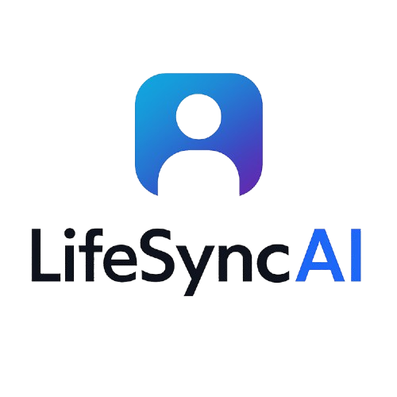

# LifeSync AI - Comprehensive Life Management Platform
## Live Demo

- **Live Demo Link**: [https://lifesync-ai.netlify.app/](https://lifesync-ai.netlify.app/)
- **Demo Image**: 

## Contact

- **Email**: belfkihosni@gmail.com
- **LinkedIn**: [linkedin.com/in/hosnibelfeki](https://www.linkedin.com/in/hosnibelfeki)



## 🌟 Overview

LifeSync AI is a comprehensive AI-powered life management platform that helps users organize and optimize every aspect of their lives. From health monitoring to financial planning, from task management to relationship building, LifeSync AI provides personalized insights and recommendations to help users achieve their goals and maintain their well-being.

## 🚀 Key Features

### 🧠 AI Assistant
- **Smart Recommendations**: Personalized suggestions based on user data and habits
- **Natural Language Processing**: Chat with AI for insights and planning
- **Predictive Analytics**: Anticipates needs and provides proactive advice
- **Multi-language Support**: Available in English, French, and Arabic with RTL support

### 🏥 Health & Wellness Module
- **Comprehensive Health Tracking**: Mood, weight, exercise, sleep, water intake, steps
- **Medication Management**: Reminders and scheduling
- **Meal Planning**: AI-generated nutritional plans with dietary restrictions
- **Wellness Monitoring**: Burnout detection and crisis prevention
- **Health Insights**: Trend analysis and personalized recommendations

### 💰 Financial Tracking
- **Expense Management**: Categorized expense tracking with receipt storage
- **Budget Planning**: Smart budget creation with alerts and notifications
- **Investment Portfolio**: Track stocks, bonds, ETFs, crypto, and mutual funds
- **Financial Analysis**: Spending patterns and optimization suggestions
- **Goal-based Savings**: Progress tracking toward financial objectives

### ✅ Productivity Tools
- **Smart Task Management**: AI-powered priority scoring and scheduling
- **Goal Setting & Tracking**: SMART goals with milestone tracking
- **Project Organization**: Hierarchical task structure with dependencies
- **Time Management**: Duration estimation and real-time tracking
- **Progress Analytics**: Productivity insights and optimization

### 👥 Relationship Manager
- **Contact Organization**: Comprehensive contact management with relationship types
- **Interaction Tracking**: Record calls, meetings, gifts, and communications
- **Reminder System**: Birthday, anniversary, and follow-up notifications
- **Relationship Analytics**: Connection strength and engagement insights
- **Social Calendar**: Important dates and event planning

### 📚 Learning Assistant
- **Personalized Learning Paths**: AI-curated educational journeys
- **Spaced Repetition**: Smart flashcard system with adaptive scheduling
- **Progress Tracking**: Skill development and knowledge retention metrics
- **Quiz System**: Regular assessments with performance analysis
- **Resource Management**: Study materials and reference organization

### 🛡️ Crisis Prevention & Wellness
- **Burnout Monitoring**: Real-time stress and energy level tracking
- **Mental Health Alerts**: Early warning system for crisis prevention
- **Emergency Contacts**: Quick access to support network
- **Wellness Check-ins**: Regular mental health assessments
- **Resource Directory**: Crisis helplines and support services

## 🛠️ Technical Architecture

### Frontend Stack
- **React 18** with TypeScript for type-safe development
- **Tailwind CSS** for responsive and utility-first styling
- **Framer Motion** for smooth animations and micro-interactions
- **Recharts** for data visualization and analytics
- **Lucide React** for consistent iconography

### Backend & Database
- **Supabase** for authentication, database, and real-time features
- **PostgreSQL** with Row Level Security (RLS) for data protection
- **Edge Functions** for serverless API endpoints
- **Real-time Subscriptions** for live data updates

### AI & Intelligence
- **GroqCloud API** with LLaMA models for natural language processing
- **Custom AI Prompts** for domain-specific recommendations
- **Machine Learning** for pattern recognition and predictive analysis
- **Personalization Engine** for adaptive user experiences

### Internationalization
- **Multi-language Support**: English, French, Arabic
- **RTL Layout Support** for Arabic language
- **Cultural Localization** for date formats and conventions
- **Accessibility Compliance** with WCAG 2.1 guidelines

## 🔒 Security & Privacy

### Data Protection
- **End-to-end Encryption** for sensitive data
- **Row Level Security (RLS)** ensuring users only access their own data
- **GDPR Compliance** with data export and deletion capabilities
- **Audit Logging** for security monitoring and compliance

### Authentication
- **Secure Authentication** with Supabase Auth
- **Session Management** with automatic token refresh
- **Password Security** with bcrypt hashing
- **Account Recovery** with secure reset mechanisms

## 📱 User Experience

### Design Philosophy
- **Apple-level Design Aesthetics** with attention to detail
- **Intuitive Navigation** with consistent interaction patterns
- **Responsive Design** optimized for all device sizes
- **Dark Mode Support** for comfortable viewing
- **Accessibility First** with keyboard navigation and screen reader support

### Performance
- **Optimized Loading** with code splitting and lazy loading
- **Efficient Caching** for improved response times
- **Progressive Web App Capabilities** for offline functionality
- **Real-time Updates** without page refresh

## 🚀 Quick Start

### Prerequisites
- Node.js 18+ and npm
- Supabase account and project
- GroqCloud API key

### Installation

1. **Clone the repository**
   ```bash
   git clone https://github.com/HosniBelfeki/lifesync-ai.git
   cd lifesync-ai
   ```

2. **Install dependencies**
   ```bash
   npm install
   ```

3. **Environment setup**
   ```bash
   cp .env.example .env
   ```
   
   Configure your environment variables:
   ```env
   VITE_SUPABASE_URL=your_supabase_url
   VITE_SUPABASE_ANON_KEY=your_supabase_anon_key
   VITE_GROQ_API_KEY=your_groq_api_key
   ```

4. **Database setup**
   ```bash
   # Run migration to set up database schema
   # Execute SQL files in supabase/migrations/ in your Supabase dashboard
   ```

5. **Start development server**
   ```bash
   npm run dev
   ```

## 📊 Database Schema

The application uses a comprehensive database schema with the following main entities:

- **User Profiles**: Extended user information and preferences
- **Health Logs**: Health metrics and wellness data
- **Meal Plans**: Nutritional planning and dietary tracking
- **Medications**: Medication schedules and reminders
- **Expenses & Budgets**: Financial tracking and planning
- **Investments**: Portfolio management
- **Tasks & Goals**: Productivity and goal tracking
- **Contacts & Interactions**: Relationship management
- **Learning Paths & Flashcards**: Educational content
- **AI Conversations**: Chat history and context

## 🔧 Development

### Code Organization
- **Modular Architecture** with clear separation of concerns
- **Component-based Design** for reusability
- **Custom Hooks** for shared logic
- **Type Safety** with full TypeScript coverage
- **Error Boundaries** for graceful error handling

### Testing Strategy
- **Unit Tests** for individual components and functions
- **Integration Tests** for user workflows
- **E2E Tests** for critical user journeys
- **Performance Tests** for optimization
- **Accessibility Tests** for compliance

### Deployment
- **Vercel/Netlify** for frontend hosting
- **Supabase** for backend infrastructure
- **CDN Integration** for global performance
- **Environment Management** for staging and production

## 🤝 Contributing

We welcome contributions! Please see our [Contributing Guidelines](CONTRIBUTING.md) for details on:

- Code style and standards
- Pull request process
- Issue reporting
- Feature requests
- Documentation improvements

## 📄 License

This project is licensed under the MIT License - see the [LICENSE](LICENSE) file for details.

## 🙏 Acknowledgments

- **Supabase** for the excellent backend-as-a-service platform
- **GroqCloud** for fast and reliable AI inference
- **Tailwind CSS** for the utility-first CSS framework
- **React Team** for the amazing frontend library
- **Open Source Community** for countless libraries and tools

---

**LifeSync AI** - Empowering you to live your best life through intelligent organization and AI-powered insights.
